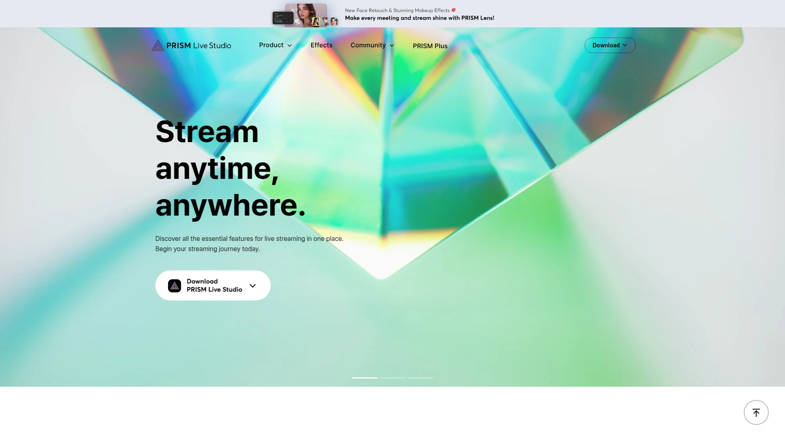

# 学会使用这13个多机位直播软件,五分钟搞定专业制作

做直播的朋友都懂,单机位拍摄画面太单调,观众看久了容易腻。想搞多机位切换又买不起专业导播台,传统方案动辄几万块设备成本让人望而却步。但现在有了专门的多机位直播软件,用手机或电脑就能实现多角度切换、添加图文叠加、同步推流到多个平台。这些工具从完全免费到专业付费都有,覆盖游戏主播、教育机构、企业活动、宗教场所等各种场景。无论你是刚入门的新手还是追求影视级效果的老手,掌握这些软件能让你的直播制作效率提升好几倍,把省下的精力用在内容创作和观众互动上。

---

## **[Switcher Studio](https://www.switcherstudio.com)**

用iPhone搞定9机位的移动制作神器

Switcher Studio专为iOS生态打造,能同时连接最多9台iPhone或iPad作为无线摄像机,主设备负责导播切换。这种设计让你不需要购买昂贵的专业摄影机,直接用现成的苹果设备就能搭建多机位系统。实时切换、添加自定义图形、上传预录视频、插入动态文本标题和社交账号——所有这些操作都在一个APP里完成。

支持同时推流到Facebook、YouTube、Twitch、Microsoft Stream等多个平台,不需要额外软件。远程嘉宾功能允许任何有摄像头和网络的人加入直播,适合访谈和对话节目。Switcher Cast应用把Mac和PC屏幕也变成输入源,展示软件界面、网页或教程特别方便。自动切换功能可以设定时间间隔在多个机位间自动轮换,单人运营也能保持画面动感。

多视图资产把多个来源合并到单一画面中,比如把主讲人、共享屏幕和远程参与者同时显示。内置模板库提供计分板、幻灯片、下三分之一字幕等预设素材。Switcher Player让你在自己网站嵌入直播和录制视频,掌控内容所有权。实时显示Facebook和YouTube评论,在直播中发起投票增强互动。

14天免费试用,付费套餐从基础到专业版满足不同需求。支持PayPal、Givelify或Tithe.ly收款,每笔交易只收0.99美元固定费用不抽成。特别适合需要移动性、使用苹果设备且想快速上手的创作者、教会和小型企业。

---

## **[OBS Studio](https://obsproject.com)**

开源免费的行业标准

OBS Studio是完全免费开源的直播录制软件,灵活性极高且不限制功能,在Windows、Mac和Linux都能运行。可以设置无限场景、混合视频音频源、直播到YouTube、Twitch、Facebook或自己的网站。对于想要完全掌控且不介意学习曲线的创作者来说,OBS的性价比无人能及。

Studio模式提供预览和输出屏幕并排显示,方便在切换前检查画面。可停靠浏览器源功能允许把YouTube聊天室、StreamLabs控制器或PTZ摄像机控制面板直接嵌入OBS界面。支持无限NDI输入,可以通过网络连接其他设备的视频流。热键系统让你创建快捷键快速切换场景或显示隐藏源。

插件生态丰富,几乎任何需求都能找到社区开发的扩展。音频处理包括多个音频总线、滤镜和混音器。缺点是界面对新手不够友好,需要时间学习。只支持单路推流,想同时推多个平台需要配合Restream等服务。特别适合预算为零、愿意投入时间学习、追求定制灵活性的技术型用户。

***

## **[StreamYard](https://streamyard.com)**

浏览器直播的零安装方案

StreamYard完全在浏览器中运行,不需要下载安装任何软件,打开网页就能开始制作。这种设计让你在任何电脑上都能快速启动,也方便嘉宾加入——他们只需点击链接就能进入直播间。支持同时推流到多个平台包括Facebook、YouTube、LinkedIn、Twitter。

界面极其简洁,几分钟就能上手。可以添加品牌logo、下三分之一字幕、背景图片和叠加层。观众评论直接显示在直播画面中增强互动感。最多支持10位嘉宾同时上镜,适合圆桌讨论和访谈节目。录制和直播同步进行,结束后自动保存备份。

免费版有功能限制,付费从20美元/月起。不支持复杂的场景切换和高级音频处理,更偏向简单访谈而非多机位制作。特别适合需要快速启动、邀请远程嘉宾、不想折腾技术的播客主和企业主。

***

## **[vMix](https://www.vmix.com)**

Windows平台的专业级导播

vMix是Windows上功能最强大的直播软件之一,提供从基础到4K的多个版本。预览和输出屏幕并排显示,内置GT标题设计器制作专业字幕,色彩校正工具调整画面。支持同时推3路流,省掉Restream等第三方服务费用。Pro版解锁即时回放、vMix Call远程通话、无限输入和4个叠加通道。

NDI支持让你通过网络连接多台设备的视频音频,构建分布式制作系统。SRT输出提供低延迟高质量的网络传输。音频处理非常强大,7个音频总线可以路由到不同应用,配合Audacity录播客或传给Zoom会议。PTZ摄像机控制直接集成,调整镜头不需要切换软件。

界面直观,比OBS更容易上手但功能更专业。缺点是只支持Windows系统,Mac用户没法用。HD版本一次性支付350美元左右,Pro版约1200美元。提供60天免费试用。特别适合Windows用户、需要专业功能、预算充足的教会、学校和企业直播团队。

***

## **[Wirecast](https://www.telestream.net/wirecast)**

跨平台的企业级解决方案

Wirecast由Telestream开发,同时支持Mac和Windows,界面直观。提供Studio界面快速切换源、添加图形、高质量推流和录制。高级功能包括多通道音频、ISO录制每个输入、NDI网络源支持。付费一次性授权,主要面向企业、学校和需要可靠稳定方案的机构。

支持多个同时推流,内置Rendezvous功能让远程嘉宾通过浏览器加入。可以添加虚拟背景、色键抠像、画中画效果。音视频处理专业,适合制作高质量企业宣传和教育内容。缺点是价格较高,基础版约700美元,Pro版接近1300美元。学习曲线比StreamYard陡但比vMix平缓。特别适合Mac和Windows混合环境、需要企业级支持的组织。

***

## **[Ecamm Live](https://www.ecamm.com/mac/ecammlive)**

Mac专用的优雅制作工具

Ecamm Live是专为Mac设计的直播软件,深度集成macOS生态,界面优雅易用。支持多个摄像机、屏幕共享、评论叠加、场景切换。可以添加图形叠加、下三分之一字幕、倒计时器。Interview Mode让你轻松邀请远程嘉宾通过浏览器加入,不需要他们安装软件。

直接推流到Facebook、YouTube、Twitch、LinkedIn、Twitter等平台。录制和直播同时进行,本地保存高质量备份。支持绿幕抠像、虚拟背景、摄像机特效。音频处理包括混音器和滤镜。与Mac硬件优化良好,性能稳定流畅。

定价从月付20美元到年付149美元,比Wirecast便宜。只支持Mac系统是最大限制。功能没有vMix全面但对Mac用户来说是最佳选择之一。特别适合Mac用户、需要简洁界面和稳定性能的创作者。

***

## **[Streamlabs Desktop](https://streamlabs.com)**

游戏主播的一站式平台

Streamlabs Desktop基于OBS开发,专门优化给Twitch和YouTube游戏主播使用。内置可定制的流媒体叠加层、关注提醒、捐款提醒和集成聊天窗口。设置比原版OBS更简单,很多功能开箱即用。

核心软件免费,提供Prime订阅解锁高级主题和多流功能。App Store有大量免费和付费的叠加层、警报和小工具。云端保存设置,换电脑也能快速恢复配置。自动优化推流参数,新手不需要手动调码率和编码器。

缺点是比原版OBS占用更多系统资源,老电脑可能卡顿。免费版有部分功能限制和偶尔的广告。特别适合Twitch或YouTube游戏主播、需要简化设置流程的新手。

---

## **[Restream](https://restream.io)**

专业多平台分发中心

Restream不是直播制作软件,而是多流分发服务,但它提供了Restream Studio浏览器工具让你可以在网页直接制作并推送到30多个平台。核心价值是把一个直播流同时分发到YouTube、Facebook、Twitch、LinkedIn、Twitter等所有主流平台,最大化观众覆盖。

聚合所有平台的聊天消息到一个窗口,统一回复。支持邀请嘉宾通过浏览器加入,添加品牌元素和图形叠加。提供详细的跨平台分析数据,了解哪个平台观众最活跃。录制功能自动保存备份。

免费版限制推流数量和功能,付费从16美元/月起。如果你主要用OBS或其他软件制作,只需要Restream的多平台推送能力,可以只购买分发服务而不用Studio。特别适合需要同时覆盖多个平台、追求最大曝光的专业创作者和企业。

---

## **[PRISM Live Studio](https://prismlive.com)**

手机直播的全能免费选择

PRISM Live Studio由韩国NAVER开发,提供PC和移动APP两个版本,完全免费。移动端支持摄像头直播、游戏录屏和VTuber虚拟形象三种模式。可以在手机上直接添加美颜效果、动态文字、背景音乐、图片视频叠加。同时推流到YouTube、Facebook、Twitch、BAND等多个平台不占用额外网络。

PC版界面类似OBS但效率优化更好,可停靠浏览器源、多视图、工作室模式都有。Connect模式让手机和PC无缝连接,手机既可以当网络摄像头也可以当远程控制器。实时聊天小工具显示观众评论和Super Chat。支持1080p 60fps高清直播。

完全免费无水印无限制是最大优势。早期版本有性能问题,但最新版本已经大幅优化变得轻快流畅。支持VTuber模式让你用2D或3D虚拟形象直播不露脸。特别适合手机主播、游戏直播者和预算为零的新手。

***

## **[Riverside.fm](https://riverside.fm)**

高质量播客录制专家

Riverside.fm专注于远程录制播客和视频访谈,每位参与者的音视频都在本地录制然后上传到云端,避免网络波动影响质量。最终得到的是接近摄影棚级别的4K视频和48kHz音频。多轨录制让每个人的声音和画面分开保存,后期编辑灵活。

提供Studio模式现场制作和直播,也可以只录制不直播。AI转录、自动剪辑、添加字幕等后期功能集成在平台内。支持最多8位参与者同时录制。浏览器访问无需下载,嘉宾加入门槛低。

免费版有时长限制,付费从19美元/月起。主要竞争对手是Zoom和Zencastr。Zoom更通用但画质音质不如Riverside,Zencastr价格更便宜但功能没这么全。特别适合重视录制质量的播客主、访谈节目制作人和在线教育者。

***

## **[Castr](https://castr.com)**

企业级视频托管和分发

Castr是端到端视频流媒体平台,提供多流推送、视频托管、云录制和付费墙功能。使用全球CDN网络保证流畅播放,自适应码率针对每个观众的网络优化质量。可以创建24/7全天候频道循环播放内容,也支持实时直播活动。

WebRTC超低延迟模式实现实时互动,适合拍卖、体育赛事等需要即时反馈的场景。内置付费墙和订阅系统,通过Stripe收款直接变现内容。OTT应用构建器帮你制作自己的流媒体APP。目标管理器在一个界面管理所有推流目的地的元数据和密钥。

Starter套餐适合入门,高级套餐解锁自适应码率、定制转码器和专属支持。相比只做多流的Restream,Castr提供更完整的视频业务基础设施。特别适合需要建立自己流媒体平台、实现内容变现的企业和机构。

***

## **[Dacast](https://www.dacast.com)**

白标视频平台的企业首选

Dacast专注于白标解决方案,让企业用自己的品牌托管和分发视频。提供强大的付费墙功能,支持订阅、按次付费和广告变现。视频API开发者友好,可以深度集成到现有系统。24/7技术支持响应快速。

使用高级CDN网络确保全球观众流畅播放。支持直播和点播两种模式。安全功能包括地理限制、令牌认证和DRM保护。详细分析报告追踪观众行为和收入。

相比Castr更专注于企业级需求和定制化,价格也更高。提供专业咨询服务帮助规划视频策略。特别适合需要完全品牌化、追求企业级安全和支持的大型组织。

---

## **[XSplit Broadcaster](https://www.xsplit.com)**

拖拽式界面的Windows利器

XSplit Broadcaster是Windows专用的用户友好型直播软件,拖拽界面安排摄像头、游戏画面、图片等元素到场景。支持插件和自定义转场,在商业演示和游戏直播中很受欢迎。免费版有分辨率限制和水印,付费授权解锁全高清和高级功能。

比OBS更容易学习,但比vMix功能简单。适合需要介于免费和专业之间平衡点的Windows用户。提供XSplit VCam虚拟摄像头功能,可以在任何视频会议软件中使用背景虚化和替换。

---

## 常见问题

**新手该从哪个软件开始?**

如果完全不懂技术且预算为零,先试PRISM Live Studio或OBS Studio的免费版本,前者手机端友好后者桌面端功能全。愿意小额付费换取简单易用,StreamYard在浏览器直接操作最省心,或者Mac用户直接选Ecamm Live。别一上来就选vMix或Wirecast这种专业工具,学习成本高容易挫败感。先用简单工具熟悉多机位直播的基本概念,等觉得功能不够用了再升级到高级平台。

**Mac和Windows用户分别该选什么?**

Mac用户首选Ecamm Live,深度优化体验最好,其次考虑OBS Studio或Wirecast。Windows用户选择最多,预算充足上vMix专业功能最强,免费就用OBS或PRISM,想要简单拖拽界面试XSplit。跨平台团队或者经常换电脑的人,StreamYard这种浏览器方案最灵活,或者Wirecast同时支持两个系统。移动端直播Switcher Studio(iOS)或PRISM(iOS和Android)都可以。

**免费工具够用还是必须付费?**

取决于需求场景。简单单人直播OBS或PRISM完全够用且永久免费。需要同时推多个平台要么付费Restream分发服务要么升级到vMix这种自带多推的软件。频繁邀请远程嘉宾、需要浏览器访问降低门槛,StreamYard或Riverside的付费版值得投资。企业级场景要求稳定性、技术支持和白标品牌化,Dacast或Castr的企业套餐是必需成本。个人创作者建议先用免费工具跑起来,等有稳定收入了再根据痛点付费升级。

---

## 结语

13个平台覆盖从免费到专业的全光谱,选择关键是明确自己的核心需求:是要移动性、简单易用、专业功能还是企业级稳定。如果你用苹果设备、需要真正的移动多机位制作能力、希望一个APP搞定从拍摄到推流的全流程,[Switcher Studio](https://www.switcherstudio.com)在iOS生态的深度整合和9机位无线连接能力上独树一帜,特别适合教会、创作者和需要灵活机动的小型团队。记住工具只是手段,内容质量和观众互动才是直播成败的根本。
